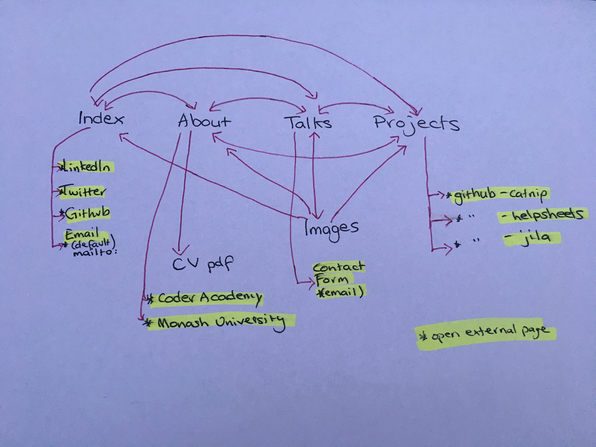
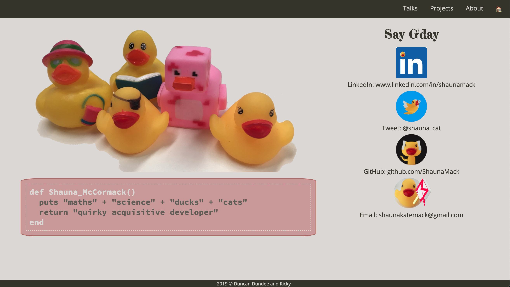
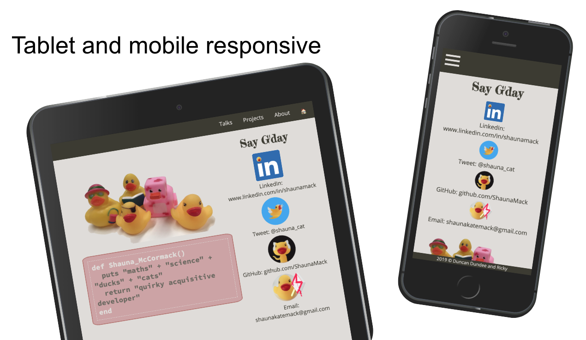
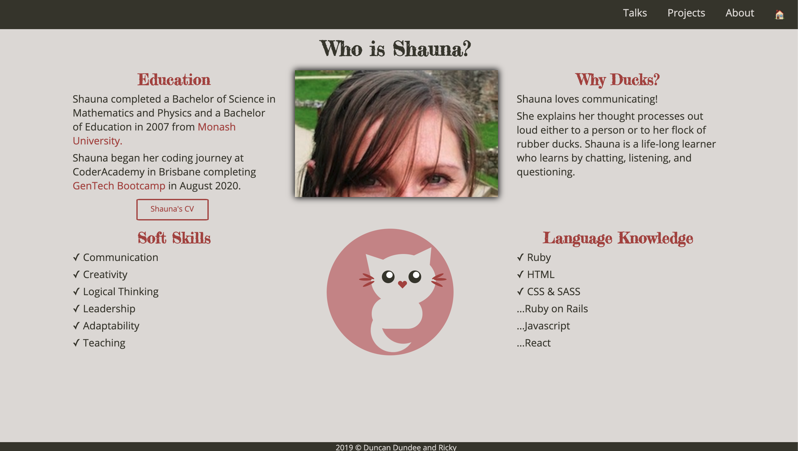
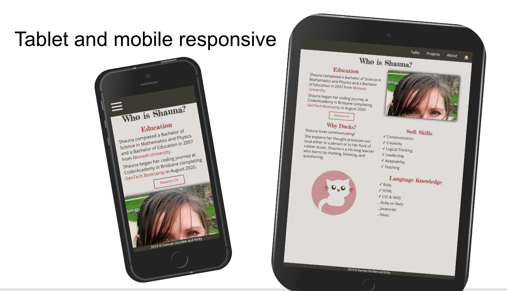
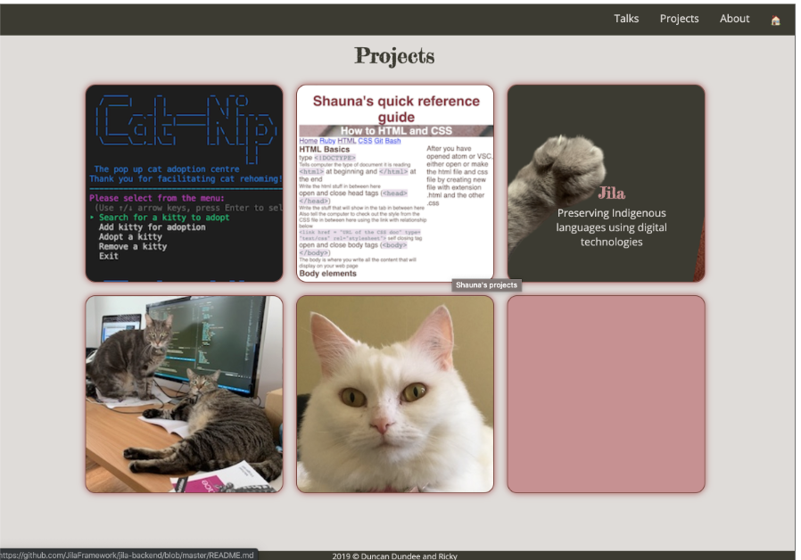
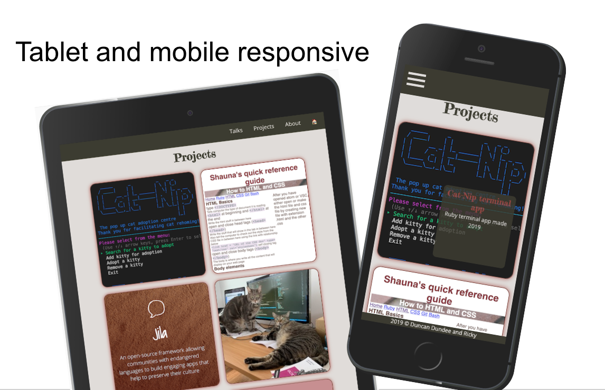
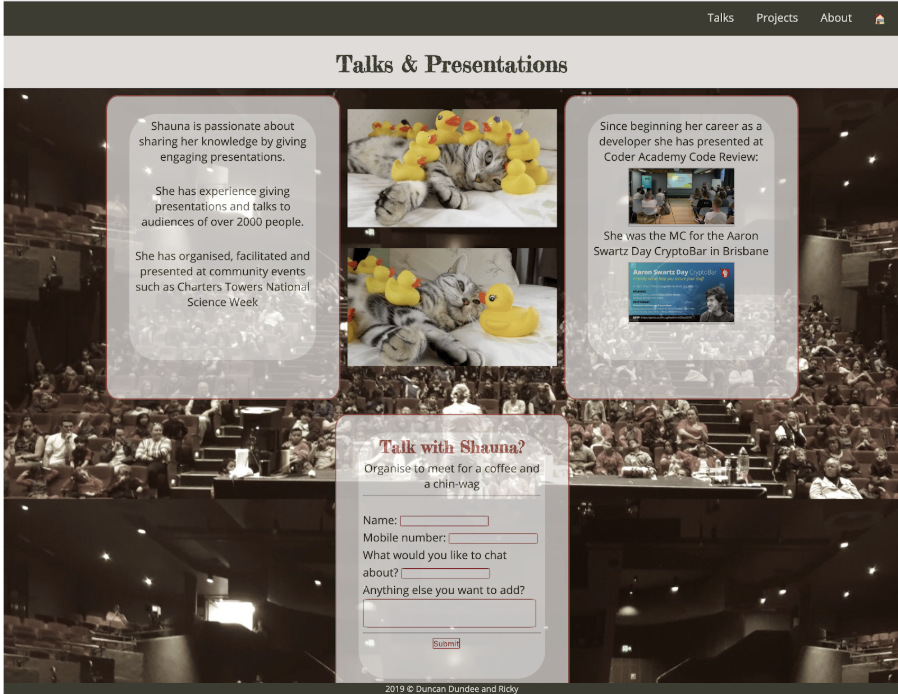
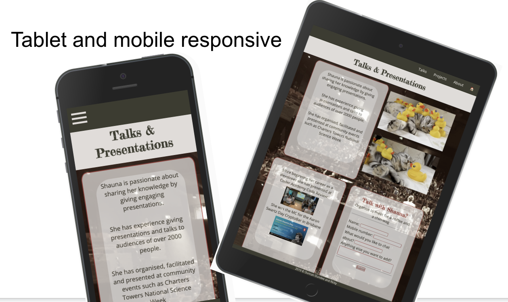

# Shauna_McCormack_T1A3

## Links
- [Published portfolio website](https://shaunamack.github.io/Shauna_McCormack_Portfolio/index.html)
- [Portfolio GitHub repository](https://github.com/ShaunaMack/Shauna_McCormack_Portfolio)

## Description of portfolio website

## Purpose

I designed this website to reflect my character and personality (hence the mix of colours and the cats), as well as to highlight my approaches to learning, teaching and software development (hence the ducks).

This website will primarily be used to showcase my skills, quirky style and personality to potential employers and conference talk organisers. I think it’s important that they know what they’re getting. 

##  Functionality / features

The Components of this website are:

- __Nav bar__ – a bar at the top with 4 links to allow people to navigate between pages. The links are highlighted when hovered over.
Footer – a sticky bar at the bottom of the page with copyright info (since all images are my own). Engages the audience by not getting in the way.
- __Contact form__ – the user selects what they want to talk to me about (from a drop down) and has a few more fields in which to enter their name, mobile number, and any other comments. The purposefully “good awful” design and informal language sets up a very informal arrangement for potential contact with me. Encourages the user to contact me by making it seem like I want to be contacted.
- __Burger menu__ – a menu that is hidden by default in the mobile view. Touching the burger will expand the menu. Engages the user by staying out of the way until it’s needed and not taking up too much space.
- __Project cards__ – display project name and title, then give a bit more info when hovered over, and are clickable to access the project. They engage the user with a quirky design that includes a cat paw on hover, and a screenshot or well-designed background image for the project. On a mobile they work differently (without the hover) but display the same information.
- __Enlarged pictures and thumbnail hover__ – on the talks page, there are a few pictures that can be enlarged by clicking on them. If you hover over them on a desktop they will display a prompt encouraging you to enlarge them.
- __CV button__ – on the about page, users can see a button which is a call to action that simply says “Shauna’s CV”. This is bold enough to make it obvious so that anyone considering hiring me will be drawn to it. If they’re on a desktop and they hover over it, it’ll get bigger and more colourful, enticing them to click.
- __Social buttons__ – on the main page, these are very prominently displayed. They are edited versions of social media icons to include a duck, and they spin when they are hovered over or clicked. They are extremely fun to play with and they beg to be clicked! Friend me!
- __Animated cat__ – as a way to learn more about CSS and as a way to make my site completely unique, I developed an animated cat using CSS. It wags its tail looking cute and helping to improve the overall aesthetic of the site.

## Target audience:
- Potential employers
- Conference talk organisers
- Meetup organisers
- Conference talk, meetup, and panel attendees
- Colleagues
- Professional Collaborators

## Sitemap

Index, About, Talks and Projects pages all link to each other via the nav menu at the top of each page. The Talks page has some image thumbnails that will show a “click to expand” message taking the user to the Images page where the images are shown full screen. From here the user returns to the other pages via the nav menu.

The About page has a link to my CV as a PDF. 

The contact form on the Talks page allows the user to enter some details and send me an email (using their default email client).

There are several other external links highlighted in yellow below.

## Screenshots

### Index Page

### About Page

### Project Page

### Talks Page

## Tech stack

- HTML
- SASS/CSS 
- Deployed on GitHub Pages

